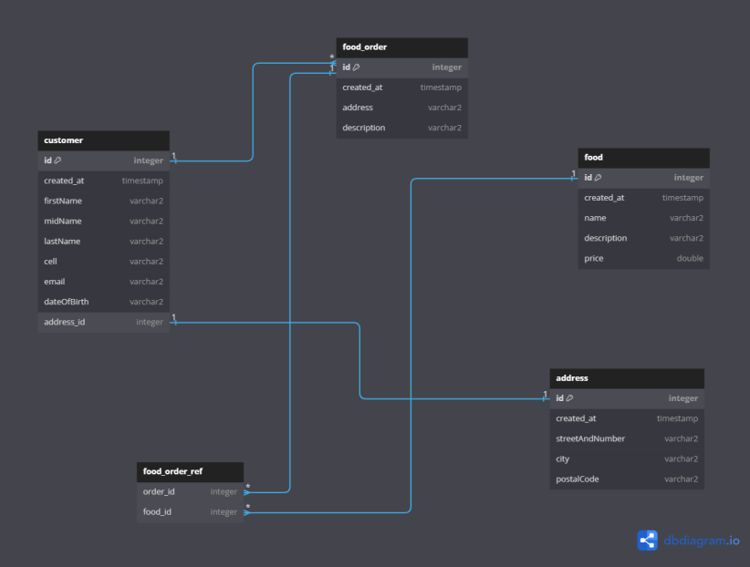

## Feeder - Food ordering system
### Project Objective:
The project is to manage a food ordering process and implement it in an IT system.   
Project specification:  
To create a food ordering system where each order is associated with a customer and a specification for the ordering process.  
Of course, a customer can have several orders. 
Foods includes a description of the food and its price.  
The personal data of the customer is also stored.  
Each customer has a residence address, which is stored in a separate entity.  
#### Glossary: see at the end

### Feeder Database Connections:

### Base entities:
Auditable - Responsible for Creation Time  
Identifier - Provides a common id for entities  

### Repositories
AddressRepository  
OrderRepository  
CustomerRepository
- Optional<Customer> findByEmail(String email) - Search customer by email

FoodRepository
- Optional<Food> findByName(String name) - Search food by name

### Models
Objects that facilitate the transfer of data between different layers

Model - Used for display on the Web interface / Rest
#### Models for customer entity
- Customer Model
- CustomerCreateModel
- CustomerUpdateModel

#### Models for address entity
- AddressModel
- AddressModelUpdateCreate

#### Models for food entity
- FoodCreateAndUpdateModel
- FoodModel

#### Models for order entity
- OrderCreateAndUpdateModel
- OrderModel

### Services

OrderService  
FoodService  
CustomerService  
AddressService

### Controllers

AddressController  
CustomerController  
FoodController  
OrderController

### Methods

#### Path of requests
Web Interface <-model-> Controller <-model-> Service <-model-> DAO(Repository) <-Entity-> database

### Service methods

#### Address Service
getAllAddress() - List all addresses  
AddAddress() - Add an address  
isRequiredFieldsExistsAndContainData() - Data check that all data exists  
getAddressById() - Returns an address by id  
DeleteAddress() - Delete one address  
updateAddress() - Updates address data  
AddNewDataToExistingAddress() - Adds data to an existing address

#### Customer Service
getAllCustomers() - List all customers  
IsCustomerAlreadyExistsWithThisEmail() - Lists if a customer already exists with this email address  
GetCustomerByEmail() - Returns a customer by email  
getCustomerById() - Returns a customer by Id

#### Food Service
getAllFoods() - List all foods  
IsFoodAlreadyExistsWithThisName() - Checks for food duplication  
getFoodByName() - Returns a food by name  
getFoodById() - Returns a food by id  
addFood() - Adds new food  
updateFood() - Updates food data  
addNewDataToExistingFood() - Update existing food  
isAllFieldsContainData() - Data check that all data exists    
deleteFood() - Deletes food by id

#### Order Service
getAllOrders() - List all orders  
addOrder() - Adds new order
getOrderById() - Returns an order by id  
addFoodToOrderById() - Adds food to the food list of the order  
deleteOrder() - Delete an order  
updateOrder() - Updates order detail
addNewDataToExistingOrder() - Updates an existing order

### Controller methods

#### Address Controller

##### listAllAddress - List all addresses
URL("/api/addresses")  
Type: GET
##### addAddress - Add new address
URL("/api/addresses")  
JSON Body: AddressModelUpdateCreate  
Type: POST
##### deleteAddress - Deletes an address based on {id}
URL("/addresses/addresses/id/{id}")  
Parameter: "id" Long  
Type: DELETE
##### updateAddress - Updates the address based on model
URL("/addresses/address/id/{id}")  
Parameter: "id" Long  
Type: PATCH

#### Customer Controller

##### listAllCustomers - All customers
URL("/api/customers")  
Type: GET
##### addCustomer - Add customer
URL("/api/customers")  
JSON Body: CustomerCreateModel  
Type: POST
##### getCustomerByEmail - Find customer by email
URL("/customers/customer/email/{email}")  
Parameter: email String  
Type: GET
##### getCustomerById - Find customer by id
URL("/customers/customer/id/{id}")  
Parameter: "id" Long  
Type: GET
##### updateCustomer - Update customer by id
URL("/customers/customer/id/{id}")  
Parameter: "id" Long  
Type: PATCH
##### deleteCustomer - Delete customer by id
URL("/customers/customer/id/{id}")  
Parameter: "id" Long  
Type: DELETE

### Food Controller
##### listAllFoods - List all foods
URL("/day/foods")  
Type: GET
##### addFood - Adds a food
URL("/api/foods")  
JSON Body: FoodCreateAndUpdateModel  
Type: POST
##### getFoodByName - Returns a food by name
URL("/foods/food/name/{name}")  
Parameter: name String  
Type: GET
##### getFoodById - Returns a food by id
URL("/foods/food/id/{id}")  
Parameter: id Long  
Type: GET
#####  updateFood - Update a food by id
URL("/foods/food/id/{id}")  
Parameter: id Long  
Type: PATCH
##### deleteFood - Delete a food by id
URL("/foods/food/id/{id}")  
Parameter: id Long  
Type: DELETE

### Order Controller

##### listAllOrders - List all orders
URL("/api/orders")  
Type: GET
##### addOrderToCustomer - Add an order to a customer
URL("/api/orders/{customerid}")  
Type: POST
##### addFoodToOrder - Adds food to the order
URL("/orders/order/id/{orderId}/food/id/{foodId}")  
Parameter: order id Long, food id Long  
Type: POST
##### removeFoodFromOrder - Removes the food from the order
URL("/orders/order/id/{orderId}/food/id/{foodId}")  
Parameter: order id Long, food id Long  
Type: DELETE
##### getOrderById - Get order by order id
URL("/orders/order/id/{orderId}")  
Type: GET
##### updateOrder - Update order by id
URL("/orders/order/id/{orderId}")  
Parameter: order id Long  
JSON Body: OrderCreateAndUpdateModel  
Type: PUT
##### deleteOrder - Delete order by id
URL("/orders/order/id/{orderId}")  
Parameter: order id Long  
Type: DELETE